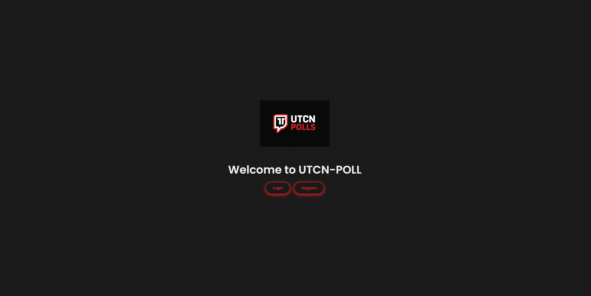
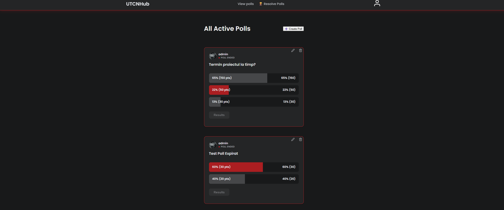
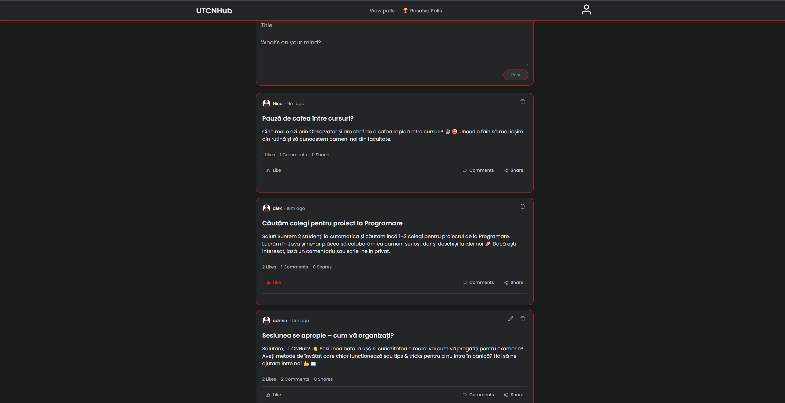

# 🗳️ UTCN Poll Platform

A full-stack web application for creating, voting on, and managing polls with integrated betting mechanics. Built with React and Spring Boot.


## ✨ Features

### 🎯 Core Functionality
- **Poll Creation & Management** - Admins can create polls with multiple options and custom durations
- **Token-Based Betting** - Users bet tokens on poll outcomes for potential rewards
- **Real-time Results** - Live vote tracking with animated progress bars
- **Poll Resolution** - Admin panel to select winners and distribute winnings automatically

### 👥 User Features
- **Secure Authentication** - JWT-based login and registration system
- **User Profiles** - Track tokens, voting history, and created polls
- **Social Feed** - Create posts, comment, and like content
- **Dark/Light Theme** - Persistent theme switching

### 🎨 UI/UX
- **Responsive Design** - Mobile-first approach with adaptive layouts
- **Smooth Animations** - Framer Motion powered transitions
- **Modern Interface** - Clean, intuitive design with custom CSS modules
- **Interactive Components** - Hover effects, loading states, and real-time updates

## 🏗️ Architecture

### Frontend (React)
```
src/
├── components/          # Reusable UI components
│   ├── PollCard/       # Poll display and voting interface
│   ├── PostCard/       # Social feed posts
│   └── TopBar/         # Navigation header
├── pages/              # Route components
│   ├── homepage/       # Social feed
│   ├── view-polls/     # Active polls list
│   ├── create-polls/   # Poll creation (admin)
│   └── admin-polls/    # Poll resolution (admin)
├── context/            # Global state management
│   ├── UserContext/    # Authentication & user data
│   └── ThemeContext/   # Theme preferences
└── hooks/              # Custom React hooks
```

### Backend (Spring Boot)
```
src/main/java/
├── controller/         # REST API endpoints
│   ├── PollController
│   ├── UserController
│   └── BlogPostController
├── models/            # Entity classes
│   ├── Poll
│   ├── Vote
│   ├── User
│   └── UserBet
├── service/           # Business logic
│   ├── PollService
│   └── UserService
├── repository/        # Data access layer
└── security/          # JWT authentication
```

## 🚀 Getting Started

### Prerequisites
- Node.js 18+ and npm
- Java 17+
- MySQL 8+
- Git

### Installation

#### 1. Clone the repository
```bash
git clone https://github.com/yourusername/utcn-poll.git
cd utcn-poll
```

#### 2. Setup Database
```sql
CREATE DATABASE utcn_poll;
```

Run the SQL migrations in `/database/schema.sql`

#### 3. Configure Backend
Edit `src/main/resources/application.properties`:
```properties
spring.datasource.url=jdbc:mysql://localhost:3306/utcn_poll
spring.datasource.username=your_username
spring.datasource.password=your_password
jwt.secret=your_secret_key
```

#### 4. Start Backend
```bash
./mvnw spring-boot:run
```
Backend runs on `http://localhost:8080`

#### 5. Setup Frontend
```bash
cd frontend
npm install
npm start
```
Frontend runs on `http://localhost:3000`

### Default Admin Account
```
Email: admin@student.utcluj.ro
Password: admin123
```

## 📊 How It Works

### Poll Creation Flow
1. **Admin creates poll** → Sets question, options, and duration
2. **Users vote** → Select option(s) and bet tokens
3. **Poll expires** → No more votes accepted
4. **Admin resolves** → Selects winning option
5. **Rewards distributed** → Winners receive proportional share of loser pool

### Betting Mechanics
```
Winner's Reward = BetAmount + (BetAmount / WinnerPool) × LoserPool

Example:
- Alice bets 20 tokens on "Yes" (Winner pool: 100)
- Bob bets 80 tokens on "Yes"
- Charlie bets 50 tokens on "No" (Loser pool: 50)

Alice receives: 20 + (20/100) × 50 = 30 tokens
Bob receives: 80 + (80/100) × 50 = 120 tokens
```

## 🔐 Security Features

- **JWT Authentication** - Secure token-based auth
- **Password Hashing** - SHA-256 encryption
- **Role-Based Access** - Admin/User/Member roles
- **Protected Routes** - Frontend and backend validation
- **CORS Configuration** - Controlled cross-origin access

## 🛠️ Tech Stack

### Frontend
- **React 18** - UI library
- **React Router** - Client-side routing
- **Framer Motion** - Animations
- **React DatePicker** - Date/time selection
- **CSS Modules** - Scoped styling
- **Context API** - State management

### Backend
- **Spring Boot 3** - Java framework
- **Spring Security** - Authentication/Authorization
- **Spring Data JPA** - Database ORM
- **Hibernate** - Object-relational mapping
- **MySQL** - Relational database
- **JWT** - JSON Web Tokens

## 📱 Screenshots

### LogIn Interface


### Poll Voting Interface


### Social Feed


## 🤝 Contributing

Contributions are welcome! Please follow these steps:

1. Fork the repository
2. Create a feature branch (`git checkout -b feature/AmazingFeature`)
3. Commit your changes (`git commit -m 'Add some AmazingFeature'`)
4. Push to the branch (`git push origin feature/AmazingFeature`)
5. Open a Pull Request

## 📝 License

This project is licensed under the MIT License - see the [LICENSE](LICENSE) file for details.

## 👨‍💻 Authors

- **Your Name** - *Initial work* - [YourGitHub](https://github.com/yourusername)

## 🙏 Acknowledgments

- Built as a project for UTCN (Technical University of Cluj-Napoca
